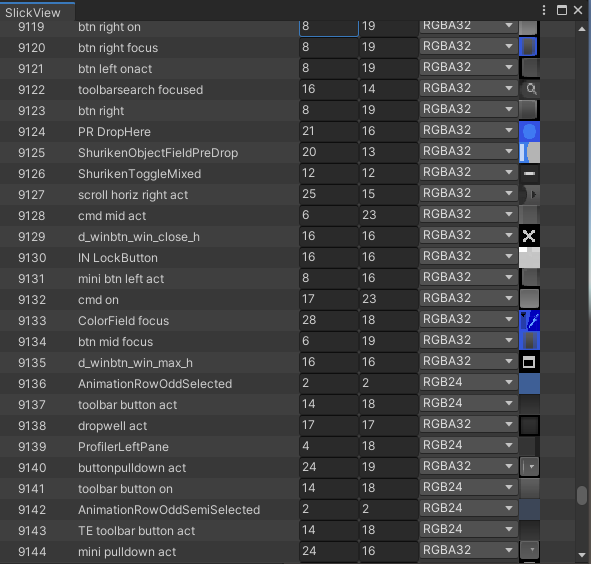

    


# SlickView

Unity Editor's built-in automatically laid out ScrollView GUI degrades in performance proportionally to how many elements are being scrolled through. 

The Editor framerate becomes unusably poor with only a few hundred elements.


### Typical Usage of the built in ScrollView
---
```csharp
            _scrollPosition = EditorGUILayout.BeginScrollView(_scrollPosition);
            for (int i = 0; i < elementList.Count; i++)
            {
                     EditorGUILayout.LabelField(elementList[i].name);
                     EditorGUILayout.IntField(i);
            }
            EditorGUILayout.EndScrollView();
```

### Typical Performance of the built in ScrollView
---
| #Elements      | Cost in ms | GC Alloc in MB |
| -------------- | ---------- |----------------|
| 100            | < 10       | < 1            |
| 1,000          | 120        | 8              |
| 1,000          | 450        | 28.4           |
| 10,000         | 3600       | 233            |
---
Its a common use-case to want to scroll through hundreds or thousands of elements. For example an editor window to display all the textures in a game could easily require more than a thousand elements which is not practical with this ScrollView.

# How does SlickView work?

Instead of iterating over the entire list of elements Slick view calculates which elements will be visible and only processes those. This means the performance stays constant regardless of how many elements are in the list.

### Typical usage of SlickView
---
```csharp
            void OnEnable()
            {
                _slickViewLayout = new SlickViewLayout(totalRows, rowHeight, DrawElement);
            }

            void OnGUI()
            {
                _slickViewLayout.Draw(position, elementList.Capacity);
            }
            
            void DrawElement(Rect rect, int row)
            {
                 EditorGUI.LabelField(rect,elementList[row].name);
                 rect.x += elementWidth;
                 EditorGUI.IntField(rect,row);
            }
```
### Typical Performance of SlickView
---
| #Elements      | Cost in ms | GC Alloc in MB |
| -------------- | ---------- |----------------|
| 100            | < 10       | 0.1            |
| 1,000          | < 10       | 0.1            |
| 1,000          | < 10       | 0.1            |
| 10,000         | < 10       | 0.1            |

---


|  | 
|:--:| 
| *Screenshot of the demo window in SlickView with 10,000 textures* |

To bring up this demo window select Slick View -> Open Demo Window